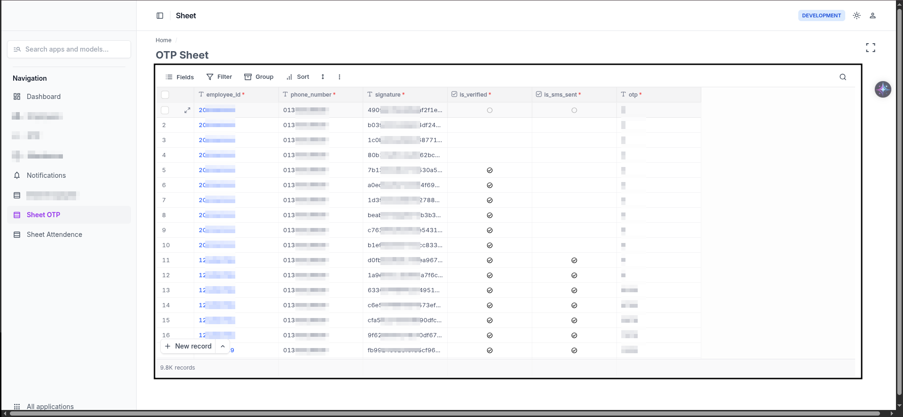

````markdown
# NocoDB Embeddable GUI

Minimalist UI to embed NocoDB project/tables into any website or app.

  

## Features

- Embed NocoDB project or table
- Read + Write, interactive grid view
- Mobile-friendly, responsive design

## Usage

1. **Embed with iframe**
```html
<iframe
  src="https://your-nocodb-instance.com/embed/project/{projectId}/table/{tableId}"
  width="100%"
  height="600"
  frameborder="0">
</iframe>
````


Example:

```html
<iframe
  src="https://your-nocodb-instance.com/embed/project/{projectId}/table/{tableId}?readonly=true&theme=dark"
  width="100%"
  height="600"
  frameborder="0">
</iframe>
```

## Requirements

* Self-hosted or cloud NocoDB instance
* Public project/table access enabled

## License

MIT

```
```
